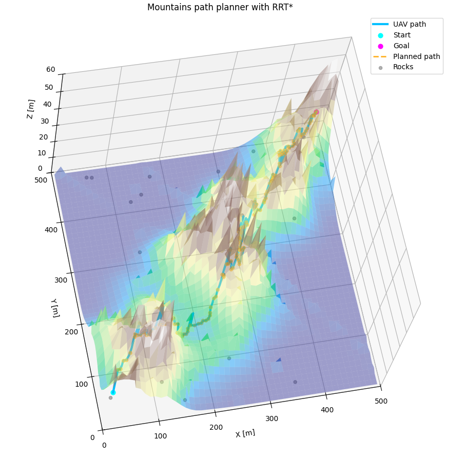
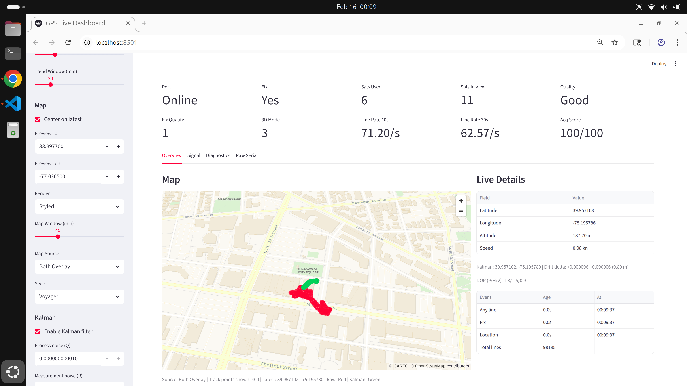

# UAV Controller + Path Planning

Multi-purpose quadcopter control stack with:
- **ROS 2 control + safety pipeline** (hardware and RViz simulation)
- **Standalone Python simulator** (no ROS) for fast iteration on planners/controllers
- **ESP32 TX/RX link** for manual flight + autonomous command relay

## What's in this repo

- **Controllers**
  - **ROS 2**: PID / LQR / MPC (work-in-progress depending on package)
  - **Python-only** (`sim_py`): PID / LQR / MPC position controllers
- **Path planning (Python-only)**: straight / A* / RRT planners
- **Terrain generation**: forest / mountains / plains (shared between ROS and Python sim)
- **Safety**: validation, limiting, watchdog (`safety_gate`)
- **Hardware link**: CRSF adapter + ESP-NOW based TX/RX + protocol bridging

## Demo (A*, RRT, RRT* path planner)

<p>
  
  
</p>

<p>
  
  
</p>

## Architecture (high level)

**Manual Flight**

```
TX (IMU+Joystick) -> ESP-NOW -> RX -> Protocol Bridge -> Flight Controller
                                      (CRSF/SBUS/PPM/iBus/FrSky)
```

**Autonomous (Hardware-in-the-loop)**

```
ROS Controllers -> Safety Gate -> CRSF Adapter -> UDP -> TX -> ESP-NOW -> RX -> Protocol -> FC
```

**Simulation**

- **ROS 2 + RViz**:

```
Controllers -> Safety Gate -> sim_dyn -> RViz
```

- **Python-only (no ROS)**:

```
Planner -> Controller -> Dynamics backend (pointmass/rotorpy) -> Matplotlib 3D
```

## Quick start (Python-only simulator)

```bash
./scripts/setup_sim_py_venv.sh
source sim_py/.venv/bin/activate
python -m sim_py.run_sim
```

Optional RotorPy backend:

```bash
./scripts/setup_sim_py_venv.sh --with-rotorpy
source sim_py/.venv/bin/activate
python -m sim_py.run_sim --backend rotorpy
```

Useful overrides:

```bash
# Switch controller
python -m sim_py.run_sim --controller mpc

# Change terrain type (still uses the terrain config YAML unless overridden)
python -m sim_py.run_sim --terrain forest

# Override sim time / dt (if you pass these, they override sim_config.yaml)
python -m sim_py.run_sim --sim-time 240 --dt 0.01

# Use a different terrain config file
python -m sim_py.run_sim --terrain-config ros2_ws/src/terrain_generator/config/terrain_params.yaml

# Select dynamics backend (default: pointmass)
python -m sim_py.run_sim --backend rotorpy
```

### Python sim configuration

- **Main config**: `sim_py/sim_config.yaml`
  - **Start/goal**: `path.start_relative_*`, `path.end_relative_*`
    - `end_relative_z: "auto"` picks a random goal altitude in \([0, \text{tallest tree}]\)
  - **Planner**: `path.planner_type` = `straight` | `astar` | `rrt` | `rrt*`
  - **Runtime**: `controller.sim_time`, `controller.dt`
  - **Backend**: `simulation.backend` = `pointmass` | `rotorpy` (CLI `--backend` overrides)
  - **Terrain appearance / scaling**:
    - `visual.forest_density_scale`: scales forest density (clamped to 1.0)
    - `visual.tree_height_scale`: scales sampled tree heights
    - `visual.height_ratio`: sets map height as `height_ratio * tallest_tree`
    - `visual.tree_radius_ref`: reference radius for drawing thicker/thinner trunks

- **Terrain config** (shared with ROS):
  - `ros2_ws/src/terrain_generator/config/terrain_params.yaml`
  - Forest obstacle count is mainly set by:
    - `forest.grid_size` and `forest.density`
    - expected trees ~= \(grid\_size^2 \cdot density\)

## Quick start (ROS 2)

### Gazebo / Ground-Air stack (current)

The rebuilt Gazebo + ground-station / air-unit stack now lives in `ros2_ws`.

- Workspace docs / runbook: `ros2_ws/README.md`
- Primary sim bringup: `ros2 launch sim_gazebo bringup.launch.py`
- Ground station bringup: `ros2 launch ground_station ground.launch.py`

### Build

```bash
cd ros2_ws
colcon build --symlink-install
source install/setup.bash
```

### Run Gazebo / Fast simulation

```bash
ros2 launch sim_gazebo bringup.launch.py
ros2 launch ground_station ground.launch.py

# Fast headless backend
ros2 launch sim_fast bringup.launch.py
```

### Legacy ROS2 prototype scripts

The old RViz/controller prototype workspace was replaced during consolidation.
If you still need the legacy PID/LQR/MPC ROS2 stack, recover it from git history.
Current ROS2 workflows are documented in `ros2_ws/README.md`.

## Docker quick start
Dockerfiles are split by workflow:

- ROS 2 Humble: `docker/Dockerfile.humble`
- Python simulator/tools: `docker/Dockerfile.sim`
- Firmware tooling (PlatformIO): `docker/Dockerfile.firmware`

Build and run:

```bash
# ROS 2 image
docker build -f docker/Dockerfile.humble --target ros-dev -t uav-controller:ros-humble .
docker run --rm -it --network=host --privileged -v "$PWD":/workspace uav-controller:ros-humble

# sim_py + Python tools image
docker build -f docker/Dockerfile.sim -t uav-controller:sim .
docker run --rm -it -v "$PWD":/workspace uav-controller:sim

# firmware / PlatformIO image
docker build -f docker/Dockerfile.firmware -t uav-controller:firmware .
docker run --rm -it -v "$PWD":/workspace uav-controller:firmware
```

More details: `docker/README.md`.

## GPS module (ESP32)

The `gps/` project is an ESP32 GPS bring-up/telemetry module using `Adafruit_GPS`.

- Supports PMTK/NMEA modules (Adafruit Ultimate GPS / MTK33xx style)
- Supports u-blox modules with UBX configuration (while parsing NMEA output)
- Auto-probes common UART baud rates (9600/38400/115200), parses fix/satellite/SNR metrics, and prints diagnostics over serial
- Build/flash protocol options:
  - `pio run -d gps -e gps_auto -t upload` (AUTO detect PMTK vs UBLOX)
  - `pio run -d gps -e gps_pmtk -t upload` (force PMTK mode)
  - `pio run -d gps -e gps_ublox -t upload` (force UBLOX mode)



## Packages / folders

| Path | Type | Purpose |
|------|------|---------|
| `ros2_ws/src/air_unit` | Python | Air-side command manager / mission executor / telemetry adapter |
| `ros2_ws/src/ground_station` | Python | CLI, monitor, and demo mission tools |
| `ros2_ws/src/planner` | Python | ROS2 planner service wrapper for `sim_py` planners |
| `ros2_ws/src/sim_bridge` | Python | Backend adapters (Gazebo / fast sim) |
| `ros2_ws/src/sim_fast` | Python | Headless simulation bringup |
| `ros2_ws/src/sim_gazebo` | Python | Gazebo Sim bringup and assets |
| `ros2_ws/src/px4_bridge` | Python | PX4 bridge scaffolding |
| `ros2_ws/src/uav_algorithms` | Python | Shared algorithms / planning API helpers |
| `ros2_ws/src/drone_msgs` | ROS msgs/srvs | Command, telemetry, mission, planner interfaces |
| `ros2_ws/src/terrain_generator` | Python | Terrain + obstacles (forest/mountains/plains) |
| `sim_py` | Python | Standalone planner/controller/dynamics/visualization |
| `ESPNOW_TX` | ESP32 | ESP-NOW based TX/RX firmware |
| `LoRa_TX` | ESP32 | LoRa TX experiments |
| `gps` | ESP32 | GPS telemetry module (Adafruit_GPS / NMEA + PMTK + UBX support) |
| `Utils` | Python | Protocol decoder/monitor + tools |

## ROS topics (common)

The topic list below reflects the legacy prototype and may differ from the new `/uav1/...` topic layout in `ros2_ws`.

| Topic | Type | Description |
|-------|------|-------------|
| `/cmd/body_rate_thrust` | `BodyRateThrust` | Controller output |
| `/cmd/final/body_rate_thrust` | `BodyRateThrust` | After safety (sim) |
| `/cmd/final/rc` | `VirtualRC` | After safety (hardware) |
| `/state/odom` | `Odometry` | State estimate |
| `/state/attitude` | `QuaternionStamped` | Orientation |
| `/state/angular_velocity` | `Vector3Stamped` | Body rates |

## Docs

- **[docs/SOFTWARE_GUIDE.md](docs/SOFTWARE_GUIDE.md)**: software guide (start here)
- **[docs/EXAMPLE_USAGE.md](docs/EXAMPLE_USAGE.md)**: terrain + controller examples
- **`sim_py/INFO.md`**: standalone simulator architecture + usage
- **`docker/README.md`**: Docker build/run commands by workflow
- **`docs/HARDWARE.md`**: TX integration for autonomous mode
- **`ESPNOW_TX/README.md`**: TX/RX firmware details
- **`gps/DASHBOARD.md`**: GPS serial dashboard usage
- **`Utils/README.md`**: protocol monitor / decoder tooling

## Notes

- **ROS 2 Humble** is required for ROS-based control + RViz simulation
- The **Python-only sim** (`sim_py`) is designed for fast iteration (no ROS needed)

## Hardware photo


*Test brushed quad with the custom TX/RX.*
