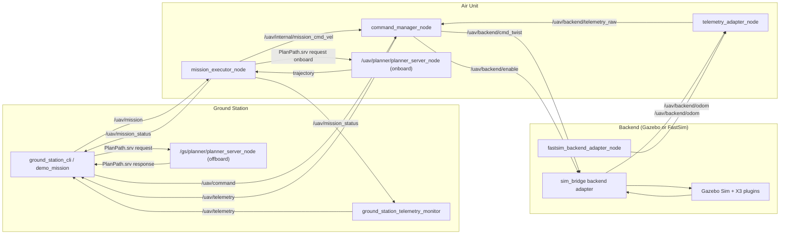

# ROS2 Workspace (Gazebo + Ground Station / Air Unit)

This workspace contains the rebuilt ROS2 + Gazebo simulation stack for `UAV-Controller`.

Status:
- `drone_msgs` interfaces (commands / telemetry / mission / planner service)
- Gazebo Sim bringup with upstream X3 multicopter velocity-control plugins
- ROS2 `ros_gz_bridge` topic bridging
- Ground station CLI / monitor / demo mission nodes
- Air unit command manager / telemetry adapter / mission executor
- Planner service wrapping the existing `sim_py` planner + terrain generation
- Fast headless simulation backend (`sim_fast`)

Primary target:
- Linux (Ubuntu) with ROS 2 Humble (22.04) or ROS 2 Jazzy (24.04)
- Gazebo Sim + `ros_gz` integration

## Prerequisites (Linux)

Install:
- ROS 2 Humble (Ubuntu 22.04) or ROS 2 Jazzy (Ubuntu 24.04)
- Gazebo Sim (Harmonic recommended with Humble, per `ros_gz` compatibility docs)
- `ros_gz_bridge`
- `ros_gz_sim`
- `python3-colcon-common-extensions`

Repo tooling already includes a Humble devcontainer / Docker path (`docker/Dockerfile.humble`).

Ubuntu 24.04 / ROS 2 Jazzy example:

```bash
sudo apt update
sudo apt install -y \
  ros-jazzy-desktop \
  python3-colcon-common-extensions \
  python3-rosdep \
  ros-jazzy-ros-gz \
  ros-jazzy-ros-gz-bridge \
  ros-jazzy-ros-gz-sim
```

If `gz` is still missing after that, install Gazebo Sim (Harmonic) from the Gazebo package repository so the `gz` CLI is on `PATH`.

## Build

```bash
cd ros2_ws
source /opt/ros/jazzy/setup.bash   # or /opt/ros/humble/setup.bash on 22.04
colcon build --symlink-install
source install/setup.bash
```

If colcon warns that some packages are already built in an underlay (e.g. `air_unit`, `sim_bridge`) and you intend to override them, add:

```bash
colcon build --symlink-install --allow-overriding air_unit sim_bridge
```

(Include only the package names that colcon lists in the warning.)

## One-Command Demo (Gazebo + Forest + Offboard RRT* + Auto Mission)

This starts the full test stack in one launch:
- Gazebo sim bringup (mission-capable vehicle profile, default `lr_drone`)
- terrain generator (`forest`)
- ground station planner server (`/gs/planner`)
- auto demo mission configured for `offboard` + `rrt*`
- safer planner + path-following defaults (higher inflation, path validation, slower tracking)
- low-corridor path altitude defaults for forest (`~3m`, routes around trees instead of over canopy)
- reset auto-recovery for the custom drone backend (disables / settles / re-enables after Gazebo reset)
- Gazebo path visuals (waypoint spheres + connected line segments with progress recolor updates)

```bash
cd ros2_ws
source /opt/ros/jazzy/setup.bash   # or /opt/ros/humble/setup.bash
source install/setup.bash
ros2 launch sim_gazebo all_in_one_rrt_star_demo.launch.py
```

Useful overrides:

```bash
# Headless
ros2 launch sim_gazebo all_in_one_rrt_star_demo.launch.py headless:=true

# Increase delay before auto mission starts (if your machine is slow)
ros2 launch sim_gazebo all_in_one_rrt_star_demo.launch.py demo_delay_sec:=12.0

# Disable Gazebo terrain/path marker mirrors (planner still runs)
ros2 launch sim_gazebo all_in_one_rrt_star_demo.launch.py start_terrain_visuals:=false start_path_visuals:=false

# Force X3 instead (fallback / comparison)
ros2 launch sim_gazebo all_in_one_rrt_star_demo.launch.py vehicle_profile:=x3

# Open RViz too (optional debug)
ros2 launch sim_gazebo all_in_one_rrt_star_demo.launch.py start_rviz:=true
```

Notes:
- Default is `vehicle_profile:=lr_drone`.
- `vehicle_profile:=x3` remains available as fallback / comparison mode.
- `vehicle_profile:=lr_drone` uses a custom controlled world (`flat_world_lr_drone_controlled.sdf`) with first-pass multicopter plugin wiring for `frame` / `Prop_*` / `prop_*_joint`.
- `vehicle_profile:=lr_drone` now uses a Gazebo-native controlled model (`models/lr_drone_controlled/model.sdf`) for better reset stability than runtime URDF conversion.
- The `lr_drone` controlled mode is expected to need tuning (motor constants/gains/limits), but the launch/bridge/plugin path is wired.
- Offboard planner failures no longer silently fall through to an unsafe straight-line path: planner output is segment-validated before mission publication.

## Custom Drone URDF Workflow (`sim_gazebo/models/lr_drone_urdf`)

This repo now includes a local custom drone URDF model workflow for:
- RViz assembly / alignment iteration
- Gazebo preview spawning
- Gazebo mission-capable controlled world (experimental first-pass plugin tuning, now using a Gazebo-native SDF model)

### Files (Current)

- RViz URDF (uses `package://...` mesh URIs):
  - `src/sim_gazebo/models/lr_drone_urdf/lr_drone_urdf.urdf`
- Gazebo URDF (uses `model://...` mesh URIs):
  - `src/sim_gazebo/models/lr_drone_urdf/lr_drone_gazebo.urdf`
- Gazebo model metadata:
  - `src/sim_gazebo/models/lr_drone_urdf/model.config`
- Alignment source-of-truth (shared prop/frame geometry values):
  - `src/sim_gazebo/models/lr_drone_urdf/lr_drone_alignment.yaml`
- Alignment generator (patches URDF + controlled SDF from YAML):
  - `src/sim_gazebo/scripts/generate_lr_drone_models.py`
- Gazebo preview world (spawns local custom drone):
  - `src/sim_gazebo/worlds/flat_world_lr_drone_preview.sdf`
- Gazebo controlled model (used by `vehicle_profile:=lr_drone` mission sim):
  - `src/sim_gazebo/models/lr_drone_controlled/model.config`
  - `src/sim_gazebo/models/lr_drone_controlled/model.sdf`
- One-command RViz viewer launch:
  - `src/sim_gazebo/launch/view_lr_drone_urdf.launch.py`
- Custom flight debug launch (controlled drone, no mission stack):
  - `src/sim_gazebo/launch/lr_drone_flight_debug.launch.py`

### Why Two URDF Files?

RViz and Gazebo resolve mesh paths differently in this workflow:
- RViz works reliably with `package://sim_gazebo/...`
- Gazebo model include path works reliably with `model://lr_drone_urdf/...`

Use the alignment YAML + generator workflow below so geometry / joint edits are applied consistently
to both URDF variants and the controlled SDF model.

### Build / Rebuild Notes (Important)

If `colcon build --symlink-install` fails for `sim_gazebo` with `File exists` under `install/sim_gazebo/.../models/lr_drone_urdf/...`, clean only the `sim_gazebo` artifacts and rebuild:

```bash
cd ros2_ws
rm -rf build/sim_gazebo install/sim_gazebo log/latest_build/sim_gazebo
colcon build --symlink-install --packages-select sim_gazebo
source install/setup.bash
```

### RViz URDF Alignment (Recommended)

This launches `robot_state_publisher`, `joint_state_publisher` (non-GUI), and RViz with `Fixed Frame=frame`, `RobotModel`, and `TF` already configured:

```bash
cd ros2_ws
source /opt/ros/jazzy/setup.bash   # or /opt/ros/humble/setup.bash
source install/setup.bash
ros2 launch sim_gazebo view_lr_drone_urdf.launch.py
```

### Gazebo Preview (Custom Drone Default for `spawn_only` / `headless`)

Preview only (fast iteration on visuals / URDF alignment):

```bash
cd ros2_ws
source /opt/ros/jazzy/setup.bash   # or /opt/ros/humble/setup.bash
source install/setup.bash
ros2 launch sim_gazebo spawn_only.launch.py
```

Headless preview:

```bash
ros2 launch sim_gazebo headless.launch.py
```

### Custom Flight Debug (Controlled Drone, No Mission)

Use this to test takeoff / hover stability without terrain generation or the auto mission:

```bash
cd ros2_ws
source /opt/ros/jazzy/setup.bash   # or /opt/ros/humble/setup.bash
source install/setup.bash
ros2 launch sim_gazebo lr_drone_flight_debug.launch.py
```

Notes:
- `bringup.launch.py` now auto-loads a safer `command_manager` parameter set for `vehicle_profile:=lr_drone`.
- Hover mode uses active vertical hold (instead of zero-twist only), which helps prevent slow vertical drift/runaway.
- Gazebo reset is now handled by `sim_reset_recovery_node` (enabled by default for `lr_drone`).

### Prop Alignment Workflow (CAD-Global Mesh Export Case)

If the frame + prop meshes were exported already placed in CAD/world coordinates, props will not automatically align after adding URDF joints. Use this workflow:

1. Measure each motor shaft / hub center in the `frame` coordinate system (meters).
2. Update `src/sim_gazebo/models/lr_drone_urdf/lr_drone_alignment.yaml`:
   - `rotors.<joint>.motor_xyz_m`
   - `rotors.<joint>.mesh_origin_xyz_m`
   - `frame_collision.*` (if needed)
3. Regenerate the model files from the YAML:

```bash
cd ros2_ws
python3 src/sim_gazebo/scripts/generate_lr_drone_models.py
```

4. Verify in order (fastest to slowest):
   - URDF preview alignment (`view_lr_drone_urdf.launch.py`)
   - Gazebo preview (`spawn_only.launch.py`)
   - Controlled hover (`lr_drone_flight_debug.launch.py`)
   - Forest mission demo (`all_in_one_rrt_star_demo.launch.py`)
5. Commit the YAML + generated file changes together.

Current prop-to-motor mapping in the URDF:
- `Prop_CCW` = front-right
- `Prop_CCW_2` = back-left
- `Prop_CW` = back-right
- `Prop_CW_2` = front-left

Current joints:
- `prop_ccw_fr_joint`
- `prop_ccw_2_bl_joint`
- `prop_cw_br_joint`
- `prop_cw_2_fl_joint`

### Next Step (Tuning Still Needed)

What is done now:
- rotor joint naming + alignment workflow
- alignment YAML + generator script for URDF/SDF sync
- custom bridge config (`bridge_topics_lr_drone.yaml`)
- custom controlled world (`flat_world_lr_drone_controlled.sdf`)
- `bringup.launch.py` / `all_in_one_rrt_star_demo.launch.py` `vehicle_profile:=x3|lr_drone`

What still needs tuning for production-quality `lr_drone` flights:
- motor constants / rotor drag / controller gains (currently reused from X3)
- velocity/acceleration limits matched to your frame
- additional collision/clearance stress-testing in dense forest

### Troubleshooting (`lr_drone`)

- Drone climbs continuously:
  - confirm `vehicle_profile:=lr_drone` is using the custom command manager params (bringup now logs resolved config)
  - test `ros2 launch sim_gazebo lr_drone_flight_debug.launch.py` first before running the all-in-one mission
- Path is too high above trees:
  - forest/mountains safe config now defaults to `path_z_mode: terrain_relative` (preserves terrain-aware Z from `sim_py`)
  - `low_corridor` mode is still available for flatter demos; only use it intentionally
  - verify your mission goal Z was not overridden to a high value
- Props look wrong after pressing Gazebo reset:
  - the controlled model is now `lr_drone_controlled` (SDF) and reset recovery is on by default
  - if still broken, relaunch once and report the first `gz` error line plus a screenshot
- One prop appears detached / floating, or front-right mount looks empty:
  - front-right has a mesh + a small cylinder fallback so the mount is never empty; if `Prop_CCW.stl` fails to load, only the cylinder shows
  - a floating prop (e.g. red) can be the multicopter plugin drawing a rotor when Gazebo reports "link [15] / entity [21] not in entity map" – fix is to resolve those physics/entity errors (e.g. Gazebo version, SDF compatibility, or simplify model)

## Recommended Test Flows (Current)

These are the current "known-good" commands for testing the planner + terrain stack.

### Dense Forest + Offboard Planner + Visualized Path (Recommended)

Terminal 1 (Gazebo + air unit + terrain obstacle visuals + planner path waypoint visuals):
```bash
cd ros2_ws
source /opt/ros/jazzy/setup.bash   # or /opt/ros/humble/setup.bash
source install/setup.bash
ros2 launch sim_gazebo bringup.launch.py \
  start_terrain_visuals:=true \
  start_path_visuals:=true
```

Terminal 2 (terrain generator, dense local forest around UAV):
```bash
cd ros2_ws
source /opt/ros/jazzy/setup.bash   # or /opt/ros/humble/setup.bash
source install/setup.bash
ros2 launch terrain_generator terrain_generator.launch.py terrain_type:=forest
```

Terminal 3 (ground station + offboard planner + monitor; monitor is throttled by default):
```bash
cd ros2_ws
source /opt/ros/jazzy/setup.bash   # or /opt/ros/humble/setup.bash
source install/setup.bash
ros2 launch ground_station ground.launch.py start_planner:=true start_monitor:=true
```

Terminal 4 (demo mission; defaults now use a farther goal for planning):
```bash
cd ros2_ws
source /opt/ros/jazzy/setup.bash   # or /opt/ros/humble/setup.bash
source install/setup.bash
ros2 run ground_station ground_station_demo_mission
```

RViz path/terrain visualization (optional, recommended):
- Add `MarkerArray` display for `/terrain/obstacles`
- Add `MarkerArray` display for `/gs/planner/planned_path_markers`

Notes:
- Gazebo path visuals now mirror both waypoint spheres and planner line strips (rendered as cylinder segments), including progress color updates as the mission advances.
- RViz still shows the native planner `MarkerArray` line + waypoint visualization.
- If you want a quieter Terminal 3, use `start_monitor:=false`.

### Mountains Terrain Surface in Gazebo (Mesh)

Terminal 1:
```bash
cd ros2_ws
source /opt/ros/jazzy/setup.bash   # or /opt/ros/humble/setup.bash
source install/setup.bash
ros2 launch sim_gazebo bringup.launch.py start_terrain_surface:=true
```

Terminal 2 (optional terrain markers for planning/RViz extras):
```bash
cd ros2_ws
source /opt/ros/jazzy/setup.bash   # or /opt/ros/humble/setup.bash
source install/setup.bash
ros2 launch terrain_generator terrain_generator.launch.py terrain_type:=mountains
```

## Run (Gazebo, Offboard Planning)

Terminal 1 (sim + air unit):
```bash
cd ros2_ws
source /opt/ros/jazzy/setup.bash   # or /opt/ros/humble/setup.bash
source install/setup.bash
ros2 launch sim_gazebo bringup.launch.py
```

Terminal 2 (terrain markers; required if testing terrain/planning visuals):
```bash
cd ros2_ws
source /opt/ros/jazzy/setup.bash   # or /opt/ros/humble/setup.bash
source install/setup.bash
ros2 launch terrain_generator terrain_generator.launch.py terrain_type:=forest
```

Terminal 3 (ground station + offboard planner + monitor):
```bash
cd ros2_ws
source /opt/ros/jazzy/setup.bash   # or /opt/ros/humble/setup.bash
source install/setup.bash
ros2 launch ground_station ground.launch.py start_planner:=true start_monitor:=true
```

Terminal 4 (demo mission):
```bash
cd ros2_ws
source /opt/ros/jazzy/setup.bash   # or /opt/ros/humble/setup.bash
source install/setup.bash
ros2 run ground_station ground_station_demo_mission
```

Manual override at any time (example):
```bash
cd ros2_ws
source /opt/ros/jazzy/setup.bash   # or /opt/ros/humble/setup.bash
source install/setup.bash
ros2 run ground_station ground_station_cli -- --mode manual --manual-override --arm --vx 0.5 --yaw-rate 0.2 --duration-sec 5
```

Return to hover:
```bash
ros2 run ground_station ground_station_cli -- --mode hover --arm --duration-sec 2
```

Keyboard teleop (interactive terminal):
```bash
cd ros2_ws
source /opt/ros/jazzy/setup.bash   # or /opt/ros/humble/setup.bash
source install/setup.bash
ros2 run ground_station ground_station_keyboard_teleop
```

Keyboard teleop keys (focus terminal):
- `w/s`: +/- X velocity
- `a/d`: +/- Y velocity
- `r/f`: +/- Z velocity
- `q/e`: +/- yaw rate
- `space`: zero all commands
- `u` / `j`: arm / disarm (one-shot)
- `m` / `h` / `t` / `g` / `i`: manual / hover / takeoff / land / idle mode
- `o` / `p`: offboard / onboard planning mode
- `v`: toggle `manual_override`
- `Esc` or `Ctrl+C`: quit

## Run (Gazebo, Onboard Planning)

Terminal 1:
```bash
ros2 launch sim_gazebo bringup.launch.py start_air_planner:=true start_path_visuals:=true path_marker_topic:=/uav/planner/planned_path_markers
```

Terminal 2 (terrain markers):
```bash
ros2 launch terrain_generator terrain_generator.launch.py terrain_type:=forest
```

Terminal 3 (monitor only; no ground planner):
```bash
ros2 launch ground_station ground.launch.py start_planner:=false start_monitor:=true
```

Terminal 4 (demo mission instructing onboard planning):
```bash
ros2 run ground_station ground_station_demo_mission --ros-args -p planning_mode:=onboard
```

## Run (Fast Headless Sim)

Offboard planner:
```bash
cd ros2_ws
source /opt/ros/jazzy/setup.bash   # or /opt/ros/humble/setup.bash
source install/setup.bash
ros2 launch sim_fast bringup.launch.py start_offboard_planner:=true start_onboard_planner:=false start_demo:=true demo_planning_mode:=offboard
```

Onboard planner:
```bash
ros2 launch sim_fast bringup.launch.py start_offboard_planner:=false start_onboard_planner:=true start_demo:=true demo_planning_mode:=onboard
```

## Topic / Node Diagram


```mermaid
flowchart LR
  subgraph Ground["Ground Station"]
    GSCLI["ground_station_cli / demo_mission"]
    GSMON["ground_station_telemetry_monitor"]
    GSP["/gs/planner/planner_server_node (offboard)"]
  end

  subgraph Air["Air Unit"]
    CM["command_manager_node"]
    ME["mission_executor_node"]
    TA["telemetry_adapter_node"]
    AP["/uav/planner/planner_server_node (onboard)"]
  end

  subgraph Backend["Backend (Gazebo or FastSim)"]
    SB["sim_bridge backend adapter"]
    GZ["Gazebo Sim + X3 plugins"]
    FS["fastsim_backend_adapter_node"]
  end

  GSCLI -->|/uav/command| CM
  GSCLI -->|/uav/mission| ME
  GSP -->|PlanPath.srv response| GSCLI
  GSCLI -->|PlanPath.srv request| GSP
  GSMON -->|/uav/telemetry| GSCLI
  ME -->|/uav/mission_status| GSMON

  ME -->|/uav/internal/mission_cmd_vel| CM
  CM -->|/uav/backend/cmd_twist| SB
  CM -->|/uav/backend/enable| SB
  SB -->|/uav/backend/odom| TA
  TA -->|/uav/backend/telemetry_raw| CM
  CM -->|/uav/telemetry| GSCLI
  ME -->|/uav/mission_status| GSCLI

  ME -->|PlanPath.srv request onboard| AP
  AP -->|trajectory| ME

  SB --> GZ
  GZ --> SB
  FS -->|/uav/backend/odom| TA
```

## Core Topics

- `/uav/command` (`drone_msgs/msg/Command`)
- `/uav/mission` (`drone_msgs/msg/Trajectory`)
- `/uav/telemetry` (`drone_msgs/msg/Telemetry`)
- `/uav/mission_status` (`drone_msgs/msg/MissionStatus`)
- `/uav/backend/cmd_twist` (`geometry_msgs/msg/Twist`)
- `/uav/backend/enable` (`std_msgs/msg/Bool`)
- `/uav/backend/odom` (`nav_msgs/msg/Odometry`)
- `/uav/backend/telemetry_raw` (`drone_msgs/msg/Telemetry`)

Gazebo bridged topics:
- `/model/x3/odometry`
- `/X3/gazebo/command/twist`
- `/X3/enable`

## Troubleshooting

- Drone stuck underground or run/stop flickering
  - World spawn height is in `sim_gazebo/worlds/flat_world.sdf` (X3 `<pose>` z-value). Default 0.15 puts the bottom at ground; if the model sinks, try 0.2 or 0.3.
  - Physics uses `type="ode"` for proper dynamics. If issues persist, check that Gazebo Sim and ros_gz are compatible.
  - `land_confirm_ticks` in command_manager adds hysteresis when landing to reduce rapid arm/disarm flapping.
- Propeller not rotating around motor center (X3 from Fuel)
  - The upstream X3 model's joint axis/origin is defined in Fuel. To fix, download the model (`gz model -u "https://fuel.gazebosim.org/1.0/OpenRobotics/models/X3 UAV/4" -m X3`), ensure revolute joint axes are `<axis><xyz>0 0 1</xyz></axis>` (Z-up through motor), and use a local model path in flat_world.sdf instead of the Fuel URI.
- `gz: command not found`
  - Install Gazebo Sim and ensure `gz` is on `PATH`.
  - On Ubuntu 24.04 + Jazzy, also install `ros-jazzy-ros-gz-bridge` and `ros-jazzy-ros-gz-sim`.
- `ros_gz_bridge` node fails to start
  - Verify `ros-<distro>-ros-gz-bridge` / `ros-<distro>-ros-gz-sim` are installed (e.g. `jazzy` or `humble`).
- No motion in Gazebo
  - Check `/X3/enable` and `/X3/gazebo/command/twist` bridges are active.
  - Run smoke publisher: `ros2 run sim_bridge gz_smoke_cmd_node`
- No telemetry on `/uav/telemetry`
  - Confirm `telemetry_adapter_node` and `command_manager_node` are running.
  - Check `/model/x3/odometry` bridge and `/uav/backend/odom`.
- Planner service unavailable
  - Offboard mode needs `/gs/planner/planner_server_node`.
  - Onboard mode needs `/uav/planner/planner_server_node`.
- Path not visible
  - RViz path markers are published on `/gs/planner/planned_path_markers` (offboard) or `/uav/planner/planned_path_markers` (onboard).
  - Gazebo path visuals require `start_path_visuals:=true` in `sim_gazebo` bringup.
- Terminal output too noisy (ground station)
  - `ground_station_telemetry_monitor` is throttled by default now.
  - Disable it entirely with `ros2 launch ground_station ground.launch.py start_monitor:=false ...`

## Validation Helpers

Use scripts from repo root (Linux):
- `scripts/check_ros2_v2_topics.sh`
- `scripts/run_v2_fast_demo.sh`
- `scripts/run_v2_gazebo_demo.sh`

## Notes

- This is now the canonical ROS2 workspace path for the Gazebo/ground-air stack: `ros2_ws`.
- `terrain_generator` is included here so `sim_py` can continue to reuse the shared terrain config and generators.
