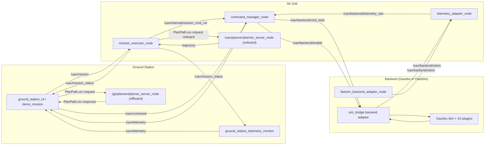

# ROS2 Workspace (Gazebo + Ground Station / Air Unit)

This workspace contains the rebuilt ROS2 + Gazebo simulation stack for `UAV-Controller`.

Status:
- `drone_msgs` interfaces (commands / telemetry / mission / planner service)
- Gazebo Sim bringup with upstream X3 multicopter velocity-control plugins
- ROS2 `ros_gz_bridge` topic bridging
- Ground station CLI / monitor / demo mission nodes
- Air unit command manager / telemetry adapter / mission executor
- Planner service wrapping the existing `sim_py` planner + terrain generation
- Fast headless simulation backend (`sim_fast`)

Primary target:
- Linux (Ubuntu) with ROS 2 Humble
- Gazebo Sim + `ros_gz` integration

## Prerequisites (Linux)

Install:
- ROS 2 Humble
- Gazebo Sim (Harmonic recommended with Humble, per `ros_gz` compatibility docs)
- `ros_gz_bridge`
- `ros_gz_sim`
- `python3-colcon-common-extensions`

Repo tooling already includes a Humble devcontainer / Docker path (`docker/Dockerfile.humble`).

## Build

```bash
cd ros2_ws
colcon build --symlink-install
source install/setup.bash
```

## Run (Gazebo, Offboard Planning)

Terminal 1 (sim + air unit):
```bash
cd ros2_ws
source /opt/ros/humble/setup.bash
source install/setup.bash
ros2 launch sim_gazebo bringup.launch.py
```

Terminal 2 (ground station + offboard planner + monitor):
```bash
cd ros2_ws
source /opt/ros/humble/setup.bash
source install/setup.bash
ros2 launch ground_station ground.launch.py start_planner:=true start_monitor:=true
```

Terminal 3 (demo mission):
```bash
cd ros2_ws
source /opt/ros/humble/setup.bash
source install/setup.bash
ros2 run ground_station ground_station_demo_mission
```

Manual override at any time (example):
```bash
cd ros2_ws
source /opt/ros/humble/setup.bash
source install/setup.bash
ros2 run ground_station ground_station_cli -- --mode manual --manual-override --arm --vx 0.5 --yaw-rate 0.2 --duration-sec 5
```

Return to hover:
```bash
ros2 run ground_station ground_station_cli -- --mode hover --arm --duration-sec 2
```

Keyboard teleop (interactive terminal):
```bash
cd ros2_ws
source /opt/ros/humble/setup.bash
source install/setup.bash
ros2 run ground_station ground_station_keyboard_teleop
```

Keyboard teleop keys (focus terminal):
- `w/s`: +/- X velocity
- `a/d`: +/- Y velocity
- `r/f`: +/- Z velocity
- `q/e`: +/- yaw rate
- `space`: zero all commands
- `u` / `j`: arm / disarm (one-shot)
- `m` / `h` / `t` / `g` / `i`: manual / hover / takeoff / land / idle mode
- `o` / `p`: offboard / onboard planning mode
- `v`: toggle `manual_override`
- `Esc` or `Ctrl+C`: quit

## Run (Gazebo, Onboard Planning)

Terminal 1:
```bash
ros2 launch sim_gazebo bringup.launch.py start_air_planner:=true
```

Terminal 2 (monitor only; no ground planner):
```bash
ros2 launch ground_station ground.launch.py start_planner:=false start_monitor:=true
```

Terminal 3 (demo mission instructing onboard planning):
```bash
ros2 run ground_station ground_station_demo_mission --ros-args -p planning_mode:=onboard
```

## Run (Fast Headless Sim)

Offboard planner:
```bash
cd ros2_ws
source /opt/ros/humble/setup.bash
source install/setup.bash
ros2 launch sim_fast bringup.launch.py start_offboard_planner:=true start_onboard_planner:=false start_demo:=true demo_planning_mode:=offboard
```

Onboard planner:
```bash
ros2 launch sim_fast bringup.launch.py start_offboard_planner:=false start_onboard_planner:=true start_demo:=true demo_planning_mode:=onboard
```

## Topic / Node Diagram



## Core Topics

- `/uav/command` (`drone_msgs/msg/Command`)
- `/uav/mission` (`drone_msgs/msg/Trajectory`)
- `/uav/telemetry` (`drone_msgs/msg/Telemetry`)
- `/uav/mission_status` (`drone_msgs/msg/MissionStatus`)
- `/uav/backend/cmd_twist` (`geometry_msgs/msg/Twist`)
- `/uav/backend/enable` (`std_msgs/msg/Bool`)
- `/uav/backend/odom` (`nav_msgs/msg/Odometry`)
- `/uav/backend/telemetry_raw` (`drone_msgs/msg/Telemetry`)

Gazebo bridged topics:
- `/model/x3/odometry`
- `/X3/gazebo/command/twist`
- `/X3/enable`

## Troubleshooting

- `gz: command not found`
  - Install Gazebo Sim and ensure `gz` is on `PATH`.
- `ros_gz_bridge` node fails to start
  - Verify `ros-humble-ros-gz-bridge` / `ros-humble-ros-gz-sim` are installed.
- No motion in Gazebo
  - Check `/X3/enable` and `/X3/gazebo/command/twist` bridges are active.
  - Run smoke publisher: `ros2 run sim_bridge gz_smoke_cmd_node`
- No telemetry on `/uav/telemetry`
  - Confirm `telemetry_adapter_node` and `command_manager_node` are running.
  - Check `/model/x3/odometry` bridge and `/uav/backend/odom`.
- Planner service unavailable
  - Offboard mode needs `/gs/planner/planner_server_node`.
  - Onboard mode needs `/uav/planner/planner_server_node`.

## Validation Helpers

Use scripts from repo root (Linux):
- `scripts/check_ros2_v2_topics.sh`
- `scripts/run_v2_fast_demo.sh`
- `scripts/run_v2_gazebo_demo.sh`

## Notes

- This is now the canonical ROS2 workspace path for the Gazebo/ground-air stack: `ros2_ws`.
- `terrain_generator` is included here so `sim_py` can continue to reuse the shared terrain config and generators.
